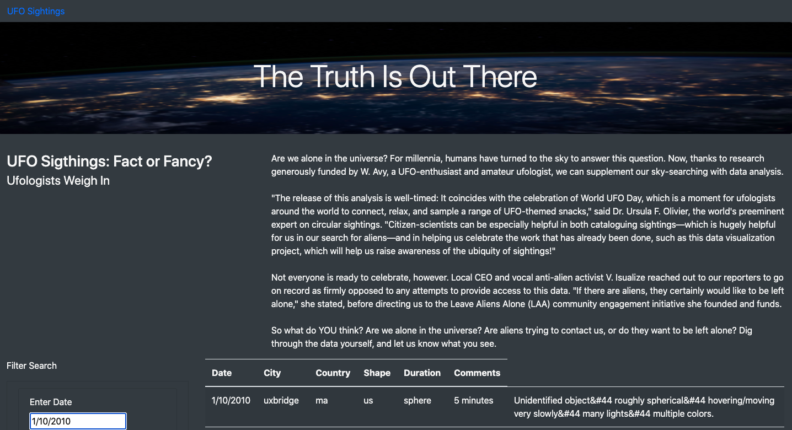
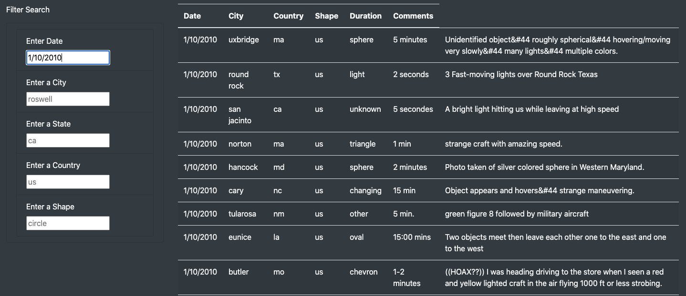
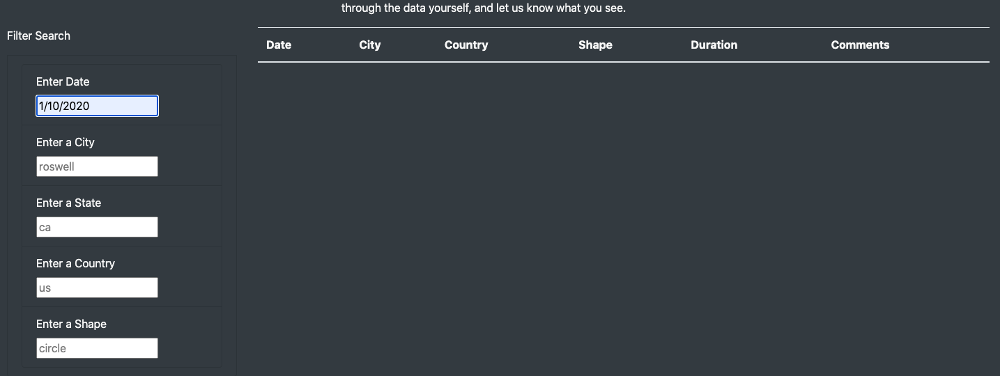

# UFOs

In this project, I built a table using data stored in a JavaScript array. Including filters to make the table fully dynamic, reacting to user input, and then placed the table into an HTML file. I then customized the webpage using Bootstrap, and equipped the table with several fully functional filters that allow users to interact with the visualizations.

## Overview of Project

## Results
The outcome was an interactive website that included a brief text about the data and five differecnt sections to filter through the data: date, city, country, shape, and duration.

* HTML and Javascript were used to construct the webpage, while CSS and Bootstrap were used to design it and make it aesthetically appealing.
* The display consists of a eye-catching page header, article title, article paragraph, interactive filters for the table, and a clean table showing the data.
* To interact with the webpage and dissect through the data, the user can insert text in the input boxes. They can use one or all five, the information they insert will appear if it exist in the data.
* If information being inserted is not in the data, the result will show no data.

* Above the fold:

* Table:

* Blank display:

## Summary

A drawback that the webpage has is that the data is limited, it only gives you information about UFO sightings throughout January 2010 in the US. In order to make the data more inclusive and revealing, we could add more countires, all months, and more years. I would recommend Dana to look for more information online, that includes different countries and a variety of dates. We could add that information to our data.apps file in the same format. Another recommendation would be to make the website more user-friendly and aesthetically appealing.
